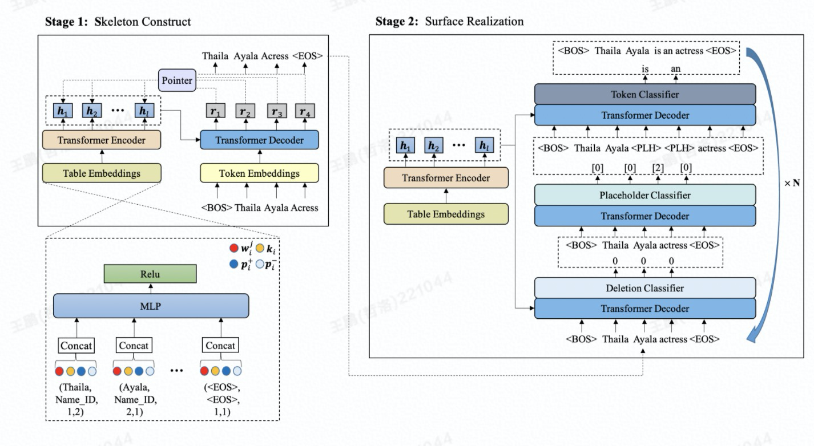

# SANA
This repo contains the code of our ACL-2021 paper: [Sketch and Refine: Towards Faithful and Informative Table-to-Text Generation](https://arxiv.org/abs/2105.14778)
<br></br>

# Model Overview
<p align="center"></p>

SANA is a skeleton-based two-stage method that combines both autoregressive and non-autoregressive generation. Our approach includes:
(1) skeleton generation with an autoregressive pointer network to select key tokens from the source table;
(2) edit-based non-autoregressive generation model to produce texts via iterative insertion and deletion operations.
<br></br>

# Requirements
* python 3.7
* pytorch 1.8.1
* nltk 3.7
* sacrebleu 1.4.14
<br></br>

# Installation
```bash
git clone https://github.com/logicwong/sana
cd fairseq
pip install --editable ./
export CUDA_HOME=/usr/local/cuda
python setup.py build_ext --inplace
```

We recommand installing NVIDIA's [apex](https://github.com/NVIDIA/apex) library for faster training.
<br></br>

# DATA
The original data was downloaded from [wiki2bio](https://github.com/tyliupku/wiki2bio)
<br></br>

# Usage

## preprocess
```
cd dataset
python3 preprocess_wikibio.py # extract box from the original data
python3 file2fairseq.py
```

## Stage1 (Sketch)
```
cd run_scripts/sketch
bash preprocess_ptr.sh # Preprocess out-of-vocabulary tokens
bash preprocess.sh # Process text data into binary data for fairseq
bash train.sh # If your GPU memory is not enough, you can decrease batch_size and increase update_freq
bash generate.sh # Generate skeletons for stage2 training
```

## Stage2 (Refine)
```
cd run_scripts/refinement
bash preprocess_ptr.sh # Preprocess out-of-vocabulary tokens
bash preprocess.sh # Process text data into binary data for fairseq
bash train.sh # If your GPU memory is not enough, you can decrease batch_size and increase update_freq
bash generate.sh # Generate descriptions and evaluate scores
```
<br></br>

# Citation
Please cite our paper if you find it helpful :)

```
@inproceedings{wang2021sketch,
  title={Sketch and Refine: Towards Faithful and Informative Table-to-Text Generation},
  author={Wang, Peng and Lin, Junyang and Yang, An and Zhou, Chang and Zhang, Yichang and Zhou, Jingren and Yang, Hongxia},
  booktitle={Findings of the Association for Computational Linguistics: ACL-IJCNLP 2021},
  pages={4831--4843},
  year={2021}
}
```
<br></br>
